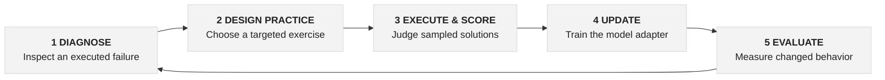

::: center
**Let Execution Do the Teaching**

*How far can we push a coding model when\
execution---not humans---does the grading?*

September 2026
:::

# 1 Introduction: make the next improvement actionable {#introduction-make-the-next-improvement-actionable .unnumbered}

A model can write a convincing C++ class and still miss the behavior
that makes it useful. Consider a phone-number cleaner. It may strip
spaces and punctuation correctly, yet accept a number whose exchange
begins with 1. Another attempt may encode the right rule but fail to
compile because a data member collides with a method name. Both attempts
fail the task. They call for different lessons.

For a practitioner, this is the real post-training problem: deciding
what to teach next. The opportunity in code is that behavior can be
exercised. A compiler can identify an interface error; tests can
distinguish a valid number from an invalid one; a reusable verifier can
apply those judgments to many sampled solutions. Human effort moves
toward designing useful practice and meaningful checks, while execution
handles the repeated grading.

#### The organizing idea.

Use the current model's limitations to choose practice, and use
executable behavior to make the learning signal concrete. The ambition
is a model-improvement process that becomes more capable and more
repeatable together.

## A learning system around the model {#a-learning-system-around-the-model .unnumbered}

We study this idea through GLM-4.7-Flash in a whole-file editing
workflow. The model receives a task and source files, then returns
replacement file contents. A successful action must satisfy the edit
interface, compile, and behave correctly. These requirements give the
improvement process observable stages: an unusable response, a broken
build, and a semantic failure can lead to different interventions.
[@r2; @r3]

The work connects three contributions. First, curricula express concrete
behaviors to practice, including full solutions and prepared repairs.
Second, rewards expose execution outcomes at useful resolution, from
individual task checks to a shared C++ verification path. Third, the
training integration preserves the intended adapter and the evidence
needed to evaluate it. Together they turn an experiment into a process
that a practitioner can inspect and extend.

Two training levers serve different purposes. Supervised fine-tuning
(SFT) teaches from task-and-answer examples, including how to express a
usable edit. Reinforcement learning samples the model's own attempts and
favors those that earn better rewards. A curriculum determines what each
stage practices. The opportunity is to choose the lever and the exercise
together, then let execution show which behaviors have changed.

# 2 Related work: three questions behind the method {#related-work-three-questions-behind-the-method .unnumbered}

**How can execution teach?** LETI uses program execution to obtain
textual feedback and trains on that feedback alongside generated
programs. [@r8] It establishes execution as a source of informative
supervision. DeepSeekMath introduces Group Relative Policy Optimization
(GRPO), which compares rewards among samples for the same problem. [@r7]
Our setting combines prepared diagnostic contexts with execution-derived
scalar rewards: text tells a sampled repair what problem it faces, while
the verifier determines how its resulting program behaves.

**Where does useful practice come from?** SWE-smith constructs
executable software-engineering tasks by introducing changes that break
tests in real codebases. [@r9] FrogNano's TaskPilot adapts task
generation and refinement to the current policy's observed success rate.
[@r11] These approaches make task construction part of the learning
system. Here, the released C++ curricula encode named repair mechanisms,
test reference and faulty implementations, and include checkpoint-bound
admission checks for tasks with mixed outcomes. This provides a concrete
route from a failure mechanism to a trainable exercise.

**What must the model be able to operate?** SWE-agent studies how an
agent-computer interface shapes software-engineering performance. [@r10]
Our interface is deliberately specific: complete edits to allowed files,
followed by build and execution. That makes response parsing and file
boundaries part of the learning contract. Low-Rank Adaptation (LoRA)
provides the parameter-efficient update mechanism: trainable low-rank
matrices adapt the model while its base weights remain fixed. [@r12] The
project's GLM/Miles integration carries those adapters through training,
rollout serving, and evaluation.

## From these ingredients to a usable recipe {#from-these-ingredients-to-a-usable-recipe .unnumbered}

The practical emphasis is the connection between decisions. Diagnose an
observed failure; choose practice at an appropriate level; establish
that the exercise can distinguish right from wrong; sample and score
attempts; update the adapter; and inspect changed behavior. The
following sections walk that chain through a real task before expanding
to the shared verifier and distributed training system.

# 3 Methodology: From a failure to a lesson {#methodology-from-a-failure-to-a-lesson .unnumbered}

*One concrete task makes the whole improvement process visible.*

<figure data-latex-placement="htbp">

<figcaption>The improvement workflow. Diagnosis and curriculum choices
are research decisions; the configured pipeline constructs exercises,
executes and scores attempts, trains adapters, and records evaluations.
Measured outcomes inform the next intervention.</figcaption>
</figure>

## 3.1 Begin with a behavior, not just a score {#begin-with-a-behavior-not-just-a-score .unnumbered}

The Phone Number curriculum records a particularly instructive
evaluation failure: a private data member named `number` collided with
the public `number()` method, so the header failed to compile. The
corresponding repair episode preserves that broken context and supplies
its diagnosis. The model must produce an implementation with a usable
public interface. This makes the lesson specific enough to practice and
the outcome concrete enough to verify. [@r2]

A second episode targets a different mechanism: missing checks on North
American area and exchange prefixes. A candidate can compile and return
plausible digits while accepting invalid numbers. The curriculum
therefore pairs defective source with the requirement that prefixes
beginning with 0 or 1 raise an error. The intervention follows the
failure type: repair the C++ interface in one case, restore a behavioral
invariant in the other.

  **Concrete input or observation**         **Required behavior**                       **Lesson**
  ----------------------------------------- ------------------------------------------- -----------------------------------
  +1 (223) 456-7890                         Return 2234567890; render (223) 456-7890.   Preserve valid normalization.
                                            Throw std::domain_error.                    Validate the exchange prefix.
  Member named number and method number()   Produce an interface that compiles.         Repair the declaration collision.

## 3.2 Package the lesson so it can be reused {#package-the-lesson-so-it-can-be-reused .unnumbered}

The task builder emits eight prompts: one full-solve task and seven
repair contexts covering missing definitions, invalid prefixes,
character handling, length, country code, display formatting, and the
observed name collision. Each prompt specifies the same public interface
and editable files. The model samples a continuation from the supplied
context; the runner then checks the resulting files. Prepared repairs
let the experiment target a known mechanism while preserving the
complete coding task around it. [@r2]

This is where a human diagnosis becomes reusable machinery. Once the
task and checks are specified, a batch of model attempts can receive
consistent feedback without a person reading and grading each answer.

## Give the learner a useful signal {#give-the-learner-a-useful-signal .unnumbered}

## 3.3 Use execution to check both the exercise and the answer {#use-execution-to-check-both-the-exercise-and-the-answer .unnumbered}

A good training task needs a dependable distinction between success and
failure. The bank-account curriculum illustrates the construction
discipline: run a reference implementation, inject a build fault, inject
a state-management fault, and exercise a separate semantic control. The
builder requires the reference to pass and the faulty candidates to fail
in the expected ways before packaging the curriculum. A task therefore
arrives with executable evidence that its judge can recognize the
behavior being taught. [@r13]

For Phone Number, the candidate is compiled against the required C++17
interface and evaluated by twelve Boolean checks. The checks exercise
normalization, invalid characters, length and country-code partitions,
prefix restrictions, and public output behavior. A *kernel* here is one
scored Boolean check; it may contain several test inputs. The twelve
checks are grouped into four policy categories. [@r2]

#### From twelve outcomes to one reward.

For checks $b_1,\ldots,b_{12}$, each equal to 0 or 1:

$$\begin{equation}
R=\frac{1}{12}\sum_{k=1}^{12}(2b_k-1).
\end{equation}$$

All twelve passing gives +1. Ten passing gives +2/3. All twelve failing
gives -1. These are arithmetic examples of the reward rule, not sampled
experimental outcomes.

The decomposition gives learning a useful slope: sampled programs can
differ in which requirements they satisfy, even when several miss the
complete task. The recorded check outcomes also help the experimenter
see what a scalar reward represents. In the Phone Number implementation,
a successful verifier result must include the expected execution receipt
before its kernel bits are accepted.

## 3.4 Choose tasks that offer room to learn {#choose-tasks-that-offer-room-to-learn .unnumbered}

Group-relative learning benefits from contrasting attempts. If every
attempt receives the same reward, that group offers no reward preference
among its samples. The generalized curriculum implements a practical
admission rule: a task must have one to three first-round successes
across four recorded trials from the specified source checkpoint.
Receipt identities and counts are checked against the admission record.
The rule uses the learner's measured behavior to select productive
practice. [@r4; @r7]

## 3.5 Reinforce the more successful attempts {#reinforce-the-more-successful-attempts .unnumbered}

GRPO samples several responses to the same prompt and uses their
relative rewards to guide the update. In the Phone Number run, eight
prompts each produced 32 samples, yielding 256 responses per rollout
batch. LoRA carried the updates into a reusable adapter. After training,
a separate task evaluation measured the saved checkpoint's first-round
solving and its response to test feedback. That separation closes the
experimental loop: the training reward directs learning, and evaluation
asks what the resulting policy can do. [@r2; @r5; @r6]

# 4 Engineering: Make the feedback worth learning from {#engineering-make-the-feedback-worth-learning-from .unnumbered}

*Every engineering choice protects a link between model behavior and
learning.*

## 4.1 Turn a generated response into the intended program {#turn-a-generated-response-into-the-intended-program .unnumbered}

The model's action is a file edit, so interpretation must be stable. The
parser extracts the final edit payload, handles the final-answer
boundary after thinking text, validates filenames, and distinguishes
recoverable formatting from prohibited edits. The runner can then
compile the candidate that the model actually supplied. This turns
response formatting into an explicit interface that can be trained and
tested. [@r3]

## 4.2 Let an environment fault remain an environment fault {#let-an-environment-fault-remain-an-environment-fault .unnumbered}

A failed program and a failed execution environment mean different
things for learning. The reward path records infrastructure-invalid
samples separately. Within a prompt group, it can replace an invalid
sample's optimization score with the mean valid score, while retaining
the raw reward and diagnostic flags. An all-invalid group is assigned
zero. This avoids creating a centered reward preference from an
environment failure and keeps the original evidence available for
investigation. [@r5]

## 4.3 Preserve the policy across training and serving {#preserve-the-policy-across-training-and-serving .unnumbered}

Distributed training introduces another question: are we sampling and
evaluating the adapter we intend to improve? The GLM integration reloads
optimizer-side parameters after an adapter warm start, keeping the
full-precision optimizer copy aligned with the loaded model. It also
stages adapter weights for synchronization with the rollout service.
These mechanisms carry a small set of learned parameter changes through
a much larger distributed system. [@r5]

## 4.4 Grow a task-specific judge into shared infrastructure {#grow-a-task-specific-judge-into-shared-infrastructure .unnumbered}

The current release extends verification through global C++ policies and
independent topic coverage. Live policies cover structure, build,
official functionality, and output/runtime requirements; warning and
sanitizer policies supply additional diagnostics. Official functional
completion is checked through a dedicated receipt path. In the
generalized reward, authenticated success earns positive credit, while
incomplete candidates receive differentiated non-positive scores. [@r4]

Topic checks make that shared judge concrete. Yacht enumerates all 7,776
ordered dice rolls across twelve categories. Sublist checks 115,600
ordered pairs of nonempty short lists, with empty-list cases handled
separately. Perfect Numbers includes widened reference arithmetic and an
independent oracle. These checks probe the semantics that a task name
alone cannot express. The topic-aware reward keeps positive credit tied
to both global correctness and required topic coverage. [@r4]

#### What scales is the judgment.

A well-designed check can grade many attempts consistently. The
engineering investment is in the task contract, the reference and
negative controls, and the execution path that connects the candidate to
its reward.

The released verifier design is described here as implementation. The
checkpoint experiments in Section 5 retain their original reward and
evaluation configurations; later verifier changes are tracked separately
in the source.

# 5 Experiments: What do we measure? {#experiments-what-do-we-measure .unnumbered}

*Separate solving on the first attempt from making productive use of
feedback.*

## 5.1 A concrete evaluation contract {#a-concrete-evaluation-contract .unnumbered}

Fixed26 is the project's fixed set of 26 C++ coding tasks evaluated
through Aider. Four trials per reported configuration produce 104
task-trial trajectories. The first-round metric asks whether a task
passes its first test round. The cumulative two-round metric asks
whether it is solved by the end of the second test round, after
feedback. A test round may contain multiple model requests. [@r1; @r6]

Conditional recovery answers a third question: among first-round
failures, what fraction become successes in round two? Keeping this
denominator visible helps distinguish a model that starts more reliably
from one that repairs more effectively.

  **Metric**             **Calculation across four trials**               **Interpretation**
  ---------------------- ------------------------------------------------ --------------------------------------------
  First-round mean       First-round successes / 4                        Tasks solved immediately, out of 26.
  Two-round mean         Tasks solved by round two / 4                    Cumulative completion, out of 26.
  Conditional recovery   New round-two successes / first-round failures   Use of the available feedback opportunity.

## 5.2 Read the release as a sequence of experiments {#read-the-release-as-a-sequence-of-experiments .unnumbered}

The results include base GLM-4.7-Flash, two supervised configurations,
two execution-midband RL configurations, Phone Number GRPO, and
Generalized C++ GRPO. SFT v5 uses 1,117 Aider-format examples over three
epochs. Synth v1 uses 260 examples, with epoch 50 selected. Recorded
warm starts carry Synth v1 into midband RL v2, then through D&D
Character into Phone Number. The release also reports the multi-task
Generalized C++ checkpoint. Luna supplies a separately hosted reference
evaluation. [@r1; @r6]

Prompt contracts are part of each result. Base and Luna use original
prompts; SFT v5 uses fixed26-contract; Synth, Phone Number, and
Generalized C++ use fixed26-contract-v2. The contract overlays supply
API/build information derived from the tests. These are
development-suite evaluations used in the project's improvement process.
The Generalized C++ result uses a selected best-four cohort and has six
training task IDs in common with Fixed26. Interpret the reported
progression with these conditions attached. [@r1]

## 5.3 The recorded training recipe {#the-recorded-training-recipe .unnumbered}

The Phone Number receipt records 20 GRPO updates on eight H100 80 GB
GPUs, BF16 execution, tensor parallelism four, and expert parallelism
eight. LoRA uses rank 16 and alpha 32. The rollout batch contains eight
prompts with 32 responses each; learning rate is 3 $\times$ 10^-5^, with
KL coefficient 0.1. The scored adapter is iteration 14. Appendix A
gathers the full settings and the result-specific evidence checks. [@r6]

## From useful edits to stronger completion {#from-useful-edits-to-stronger-completion .unnumbered}

```mermaid
---
config:
  themeVariables:
    xyChart:
      plotColorPalette: "#555555, #aaaaaa"
---
xychart-beta horizontal
    title "Grey = first test round · Dark = within two test rounds"
    x-axis ["Base (0.5 / 4.5)", "Synth v1 (9.5 / 12)", "Phone Number (11.25 / 15.25)", "Generalized C++* (11.75 / 16)"]
    y-axis "Mean tasks solved (out of 26)" 0 --> 25
    bar [4.5, 12, 15.25, 16]
    bar [0.5, 9.5, 11.25, 11.75]
```

<figure data-latex-placement="H">

<figcaption>Mean tasks solved out of 26, from the release results. Four
trials per row. *Generalized C++ is the selected best-four cohort. Bars
show observed outcomes under the contracts in Section 5.2; the complete
set of configurations appears below. </figcaption>
</figure>

  ------------------------------------------------------------------------------
  **Configuration**            **First round\   **Two rounds\   **Conditional\
                               mean / 26**      mean / 26**     recovery**
  ---------------------------- ---------------- --------------- ----------------
  GLM-4.7-Flash base           (1.9%)           (17.3%)         /102 (15.7%)

  Luna reference               (24.0%)          (64.4%)         /79 (53.2%)

  SFT v5                       (23.1%)          (39.4%)         /80 (21.2%)

  Synth v1, epoch 50           (36.5%)          (46.2%)         /66 (15.2%)

  Execution-midband RL v1      (31.7%)          (50.0%)         /71 (26.8%)

  Execution-midband RL v2      (40.4%)          (55.8%)         /62 (25.8%)

  Phone Number, iter 14        (43.3%)          (58.7%)         /59 (27.1%)

  Generalized C++, iter 14\*   (45.2%)          (61.5%)         /57 (29.8%)
  ------------------------------------------------------------------------------

  : **Table 1.** Release-reported means and recovery counts. Each row
  contains four trials and 104 task-trial trajectories. The Generalized
  C++ row is an assisted regression result with the selection and
  training overlap described in Section 5.2. [@r1]

## 5.4 What changes across the reported stages? {#what-changes-across-the-reported-stages .unnumbered}

The supervised checkpoints show a substantial change in usable task
completion: the first-round mean rises from 0.5 for the base
configuration to 6 for SFT v5 and 9.5 for Synth v1. The later
execution-guided rows extend the observed range, reaching 11.75
first-round and 16 cumulative solves in the selected Generalized C++
cohort. The table captures the progression of the complete experimental
setup, including its evolving prompt contracts.

For the practitioner, the useful question is what to do after each
stage. A higher first-round score is encouraging; the next page asks
whether repair behavior and task-level retention move with it. Those
differences are the evidence from which a subsequent intervention can be
designed.

## A better average is the beginning {#a-better-average-is-the-beginning .unnumbered}

*The interesting next lesson often appears inside the result.*

## 5.5 Solving and repairing move differently {#solving-and-repairing-move-differently .unnumbered}

Synth v1 solves more tasks in the first round than SFT v5, yet its
conditional recovery is 15.2%, compared with 21.2% for SFT v5. The Phone
Number checkpoint reaches 27.1%, and the selected Generalized C++ cohort
reaches 29.8%. These different trajectories make feedback use a
capability worth measuring directly. Luna's 53.2% recovery rate provides
a useful reference point under its separate hosted setup. [@r1]

This distinction also clarifies what a repair curriculum teaches. A
prepared repair prompt supplies a known problem state and diagnostic
context during training. A two-round evaluation asks the agent to react
to feedback from its own preceding attempt. Their relationship is an
empirical question, and the two-round metric is where it becomes
visible.

## 5.6 Return to the Phone Number example {#return-to-the-phone-number-example .unnumbered}

The running example now has a measured outcome. Across four trials,
Phone Number first-round success changes from 1/4 at Synth v1 to 4/4 at
the Phone Number checkpoint. Other tasks move too: Parallel Letter
Frequency rises from 0/4 to 3/4, while Gigasecond and Sublist decline.
These are checkpoint-level observations across the intervening training
lineage. They make retention and broader effects concrete. [@r6]

  -------------------------------------------------------------------------------
  **Task**                    **Synth v1\               **Phone Number\
                              first-round successes**   first-round successes**
  --------------------------- ------------------------- -------------------------
  Phone Number                / 4                       / 4

  Parallel Letter Frequency   / 4                       / 4

  Gigasecond                  / 4                       / 4

  Sublist                     / 4                       / 4
  -------------------------------------------------------------------------------

  : **Table 2.** Selected task-level outcomes from the released per-task
  table. Looking across tasks makes both improvement and retention
  visible.

## 5.7 Use uncertainty to choose the next experiment {#use-uncertainty-to-choose-the-next-experiment .unnumbered}

The released task-bootstrap intervals show the variation across this
small task suite. Phone Number's first-round mean is 11.25/26 with a 95%
interval of 7.5-15; its cumulative mean is 15.25/26 with an interval of
11-19.25. Generalized C++ has corresponding intervals of 8-15.5 and
11.75-20. These summarize the reported cohorts; selection and
prompt-contract differences remain part of the experimental setup.
[@r1; @r6]

The resulting next-step logic is constructive. Preserve gains on the
practiced behavior, inspect the tasks that regressed, and evaluate
subsequent interventions under a fixed contract. The evidence is useful
because it narrows the next question: which behavior needs more
coverage, which needs more reliable execution, and which needs
feedback-specific practice?

# 6 Discussion: Put expertise where it compounds {#discussion-put-expertise-where-it-compounds .unnumbered}

## 6.1 What execution takes over {#what-execution-takes-over .unnumbered}

The central shift is in where expertise is applied. People specify the
task, choose the behavior to practice, design checks, and decide which
experiment to run. The configured system repeatedly builds candidates,
tests their behavior, assigns rewards, updates adapters, and records
evaluations. A verifier can apply the same criterion to many responses;
a curriculum builder can reproduce the same exercise contract across a
run. [@r2; @r3; @r4; @r5; @r13]

  **Research and engineering decisions**               **Repeated operations handled by the system**
  ---------------------------------------------------- --------------------------------------------------------------------
  Choose the target behavior and intervention.         Construct the configured task variants and prompts.
  Define requirements, references, and controls.       Compile, execute, score, and retain check outcomes.
  Select training settings and checkpoints to study.   Sample responses, update adapters, and run configured evaluations.
  Interpret results and choose the next experiment.    Produce task-level records for comparison and diagnosis.

This division of labor gives "less human intervention" a concrete
meaning: repeated candidate grading is delegated to execution, while
experiment design remains explicit. The visible record supports that
operating model. Its natural extension is to make more of the diagnosis
and intervention-selection process systematic, using the evidence the
loop already produces.

## 6.2 What a practitioner can take away {#what-a-practitioner-can-take-away .unnumbered}

Start with a task whose behavior can be exercised. Inspect an actual
failure and name the mechanism precisely. Build a focused practice
context and validate its reference and negative controls. Sample enough
candidates to observe meaningful reward differences. Then evaluate the
saved adapter on both the target behavior and the surrounding task set.
This sequence turns post-training into a series of answerable questions.

## 6.3 Where collaborators can contribute {#where-collaborators-can-contribute .unnumbered}

The released work offers several concrete entry points: broaden
independent topic oracles; build curricula that preserve acquired
behavior while introducing new mechanisms; study live feedback repair;
and compare interventions on fresh task families under matched
evaluation contracts. Each direction extends an existing part of the
system and produces a result the rest of the loop can use.

# 7 Conclusion {#conclusion .unnumbered}

Execution gives post-training a powerful source of feedback: programs
reveal what they do. This project connects that feedback to targeted C++
practice, structured rewards, low-rank model adaptation, and
checkpoint-level evaluation. The observed results show stronger coding
performance across the released post-training configurations, while the
task-level evidence supplies the next questions to investigate.

The broader opportunity is to build improvement machinery around the
model. A well-chosen task teaches a behavior; a well-designed verifier
makes the judgment reusable; a reliable runtime turns that signal into
an experiment we can build on. That is how execution starts doing more
of the teaching.

# Appendix A: Recipe and reward contracts {#appendix-a-recipe-and-reward-contracts .unnumbered}

## A.1 Phone Number training configuration {#a.1-phone-number-training-configuration .unnumbered}

  **Setting**                        **Recorded value**
  ---------------------------------- ----------------------------------------------------------------------------------------------
  Base model and adaptation          GLM-4.7-Flash; LoRA rank 16, alpha 32.
  Training hardware                  $\times$ H100 80 GB; BF16; tensor parallel 4; expert parallel 8.
  Dispatch and serving               DeepEP flex dispatch; SGLang rollout service; Miles training integration.
  Rollout and batch                  prompts $\times$ 32 samples; global batch 256; 20 GRPO updates.
  Optimization                       Learning rate 3 $\times$ 10^-5^; constant schedule; warmup fraction 0.1; KL coefficient 0.1.
  Generation                         Sequence limit 12,288; response limit 8,192; temperature 0.7; thinking enabled.
  Warm start and scored checkpoint   D&D Character iteration 19 source adapter; Phone Number iteration 14 evaluated.

Source: the released Phone Number training receipt and launch
configurations. The receipt also records wall time and peak memory, with
timing marked unverified; the configuration above is the basis for
describing the run. [@r6]

## A.2 Reward contracts are experiment-specific {#a.2-reward-contracts-are-experiment-specific .unnumbered}

  **Reward path**                   **Definition and role**
  --------------------------------- -------------------------------------------------------------------------------------------------------------------------------------------------------------------------------------------------------------------------------------------------------------------
  Shared Aider reward               Default path: prohibited edit/runtime -1; other parse failure -0.8; compile failure or candidate timeout -0.5; full pass +1; otherwise 0.6 $\times$ test fraction. Recoverable format penalty 0.1; clipped to \[-1,1\]. A strict binary mode is also implemented.
  Phone Number kernel reward        Mean of 12 signed Boolean checks, in \[-1,1\]. The kernel record replaces the shared scalar after execution; infrastructure-invalid outcomes are flagged separately.
  Current generalized reward        Authenticated pass +1 (0.975 with recoverable format). Failed candidates: -1 plus weighted passed-check credit and available semantic partial credit, clipped to \[-1,0\]. Invalid receipts are flagged as infrastructure errors.
  Current topic-aware composition   A positive global score is preserved when required topic checks pass. Otherwise use 0.5 $\times$ min(global score,0) + 0.5 $\times$ (topic requirement fraction -1). Invalid topic evaluation is flagged separately.

Sources: shared reward implementation [@r3], Phone Number [@r2],
generalized and topic-aware rewards [@r4]. The current generalized
implementation weights its six scored kernels by 0.10, 0.20, 0.20, 0.45,
0.025, and 0.025. These contracts describe their respective source
paths; the historical checkpoints retain the configurations in their run
artifacts.

# Appendix B: Results, artifacts, and reproduction {#appendix-b-results-artifacts-and-reproduction .unnumbered}

## B.1 Complete dispersion for the reported configurations {#b.1-complete-dispersion-for-the-reported-configurations .unnumbered}

  -----------------------------------------------------------------------------
  **Configuration**   **First round\        **Two rounds\         **Recovery\
                      SD; range; 95% CI**   SD; range; 95% CI**   95% CI**
  ------------------- --------------------- --------------------- -------------
  Base                ; 0-1; 0-1.25         ; 3-6; 2.25-6.75      -24.8%

  Luna                ; 5-9; 3.25-9.5       ; 15-18; 12.75-20.5   -70%

  SFT v5              ; 4-8; 3-9.25         ; 8-12; 7-13.75       -31.6%

  Synth v1            ; 9-10; 5.75-13.5     ; 11-13; 8.25-15.75   -24.4%

  Midband RL v1       ; 6-11; 4.75-12       ; 12-14; 9-17         -41.4%

  Midband RL v2       ; 9-12; 7-14          ; 12-17; 10.5-18.5    -41.9%

  Phone Number        ; 11-12; 7.5-15       ; 15-16; 11-19.25     -44.2%

  Generalized C++\*   ; 10-13; 8-15.5       ; 14-17; 11.75-20     -48.9%
  -----------------------------------------------------------------------------

Task scores are out of 26; recovery is a percentage. SD is across
trials; intervals are the released task-bootstrap estimates. The bundled
statistics use 100,000 task-clustered resamples, retaining all four
trial outcomes within each sampled task. \*Selected best-four cohort.
[@r1; @r6]

## B.2 Inspect the branch, then follow the result-specific artifacts {#b.2-inspect-the-branch-then-follow-the-result-specific-artifacts .unnumbered}

The source for this report is **client/21-sept-release**, pinned to
commit f4b77ab623c5fed9b9503d49d77a86fa1f4299ee. The README is the entry
point for training datasets, adapters, evaluation archives, and launch
configurations. Result manifests preserve the identities of the
artifacts used in each historical experiment. [@r1; @r6]

The following checks verify the bundled SFT v5 and Phone Number
evidence, including recorded outcomes and identity checks. Both were
rerun successfully while preparing this report. Run them from the
release checkout:

python results/sft-v5-aiderfmt-1117-4trials/audit/verify.py\
python results/phone-number-kernel12-GRPO20/recompute.py --check

For execution, the README provides launch routes for the base and Luna
evaluations, midband RL v2, and Phone Number. Use each result's own
configuration and artifact references. Generalized C++ uses the registry
and admission inputs required by its implementation, together with its
linked run archive.

::: thebibliography
13

[Project release: source and Fixed26
results](https://github.com/tokenbender/browser-is-all-you-need-upstream/tree/f4b77ab623c5fed9b9503d49d77a86fa1f4299ee).
client/21-sept-release, September 2026. README, result tables,
experiment contracts, and artifact entry points.

[Phone Number curriculum and kernel
reward](https://github.com/tokenbender/browser-is-all-you-need-upstream/blob/f4b77ab623c5fed9b9503d49d77a86fa1f4299ee/Reward_GRPO/phone_number_grpo.py).
Eight task contexts, twelve executable checks, task generation, receipt
handling, and reward composition.

[Whole-file editing, parsing, execution, and shared
reward](https://github.com/tokenbender/browser-is-all-you-need-upstream/tree/f4b77ab623c5fed9b9503d49d77a86fa1f4299ee/src/glm47_posttraining/aider_polyglot).
Released task schema, parser, harness, and shared reward implementation.

[Generalized C++ and topic-level
verification](https://github.com/tokenbender/browser-is-all-you-need-upstream/tree/f4b77ab623c5fed9b9503d49d77a86fa1f4299ee/Reward_GRPO).
generalized_cpp_grpo.py, generalized_cpp_topic_grpo.py,
global_cpp_verifier_runner.py, and topic_coverage/.

[GLM/Miles training and rollout
integration](https://github.com/tokenbender/browser-is-all-you-need-upstream/tree/f4b77ab623c5fed9b9503d49d77a86fa1f4299ee/src/glm47_posttraining/integrations).
Adapter loading and synchronization, infrastructure score handling, and
training integration.

[Released experiment
evidence](https://github.com/tokenbender/browser-is-all-you-need-upstream/tree/f4b77ab623c5fed9b9503d49d77a86fa1f4299ee/results).
Result manifests, per_task_success.csv, statistics.json, run receipts,
reconstruction checks, and launch configurations.

[Shao et al. DeepSeekMath: Pushing the Limits of Mathematical Reasoning
in Open Language Models](https://arxiv.org/abs/2402.03300). 2024.
Introduces Group Relative Policy Optimization.

[Wang et al. LETI: Learning to Generate from Textual
Interactions](https://aclanthology.org/2024.findings-naacl.16/).
Findings of NAACL, 2024. Execution-derived textual feedback for code
generation.

[Yang et al. SWE-smith: Scaling Data for Software Engineering
Agents](https://arxiv.org/abs/2504.21798). 2025. Synthetic executable
task construction for software-engineering agents.

[Yang et al. SWE-agent: Agent-Computer Interfaces Enable Automated
Software Engineering](https://arxiv.org/abs/2405.15793). 2024. Agent
interface design and its effects on software-engineering performance.

[Kim et al. FrogNano: Training a 4B Coding Agent via Online Task
Synthesis](https://arxiv.org/abs/2609.07925v4). 2026, version 4. Harness
design, policy-adaptive task synthesis, and iterative reinforcement
learning.

[Hu et al. LoRA: Low-Rank Adaptation of Large Language
Models](https://arxiv.org/abs/2106.09685). 2021. Low-rank trainable
updates to frozen pretrained model weights.

[Bank-account curriculum construction and
verification](https://github.com/tokenbender/browser-is-all-you-need-upstream/blob/f4b77ab623c5fed9b9503d49d77a86fa1f4299ee/src/glm47_posttraining/aider_polyglot/bank_account_curriculum.py).
Reference implementations, build and state mutations, distinct controls,
and packaged practice contexts.
:::

## Pinned artifact links {#pinned-artifact-links .unnumbered}

- [Phone Number adapter and run
  archive](https://huggingface.co/WootzappLab/phone-number-kernel12-GRPO20/tree/adf419fcb32baa335d80c3d9a96c618f3f286a14)

- [Generalized C++ adapter and selected
  evaluations](https://huggingface.co/WootzappLab/generalized-cpp-kernel-GRPO20/tree/269560b1f4d6471a1726dd7a95712ef4e3da0838)

- [Synth training
  dataset](https://huggingface.co/datasets/WootzappLab/glm47-synth-v1-dataset/tree/face23163ca2e9c27f2506b8c757af6ed666dfb7)

- [Synth evaluation
  archive](https://huggingface.co/datasets/WootzappLab/glm47-synth-v1-fixed26-evals/tree/ec8b93b8f5916f81b9fecdc9f55960919ef92e2e)
